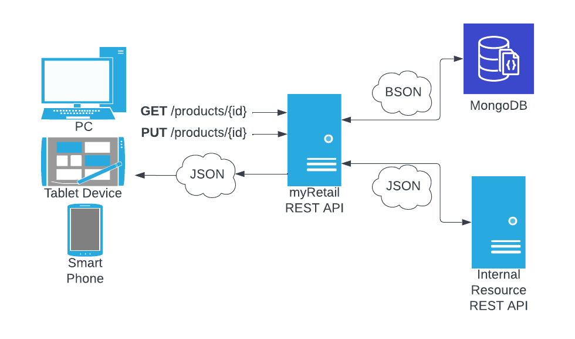

# myRetail RESTful service

## Overview



## Installation

### Check out code

```shell
git clone https://github.com/joeltmiller/myRetail.git
```

### Install Go

Install the Go programming language and toolset: [golang.org](https://golang.org/doc/install)

You can verify you've installed correctly by running:

```shell
go version
```

For this exercise I used version `1.19.1`

## Build
Make sure you are in the `myRetail` directory

```shell
go build myRetail
```

This will result in the executable file `myRetail`

## Running

Run the application with the following command:

```shell
./myRetail
```

You should then see the output:
```shell
Listening on port :80
```

## Data

Pricing data has been loaded for `13860428, 13264003, 12954218, 54456119` although data for  `54456119` is not available via the internal resource.

## Environment Variables

Normally I wouldn't include the `.env` file for security reasons, but have included it here due to the nature of the exercise.

## GET - Get Product Details

Used to retrieve product details for a given product ID.

URL: `/product/{id}`

Method: `GET`

Example call

**Note:** provided in Postman collection as well `myRetail.postman_collection.json`
```shell
curl --location --request GET 'http://localhost:80/products/13860428'
```

Example success response
```json
{"id":13860428,"name":"The Big Lebowski (Blu-ray)","current_price":{"value":12.49,"currency_code":"USD"}}
```

Example failure response
```json
{
  "errors": [
    {
      "message": "product does not exist"
    }
  ]
}
```

## PUT - Update Product Price

Used to update product price. Price is updated via the provided `value` within `current_price`.

**Note:** If ID in path does not match ID provided in body payload an error will be returned. 

URL: `/product/{id}`

Method: `PUT`

Example call

**Note:** provided in Postman collection as well `myRetail.postman_collection.json`
```shell
curl --location --request PUT 'http://localhost:80/products/13860428' \
--header 'Content-Type: application/json' \
--data-raw '{
    "id": 13860428,
    "name": "The Big Lebowski (Blu-ray)",
    "current_price": {
        "value": 13.99,
        "currency_code": "USD"
    }
}'
```

Example success response
```json
{"id":13860428,"name":"The Big Lebowski (Blu-ray)","current_price":{"value":13.99,"currency_code":"USD"}}
```

Example failure response
```json
{
  "errors": [
    {
      "message": "ID in path does not match request body"
    }
  ]
}
```

## Tests

To run tests, run the following in the root directory of the project:

```
go test -v
```